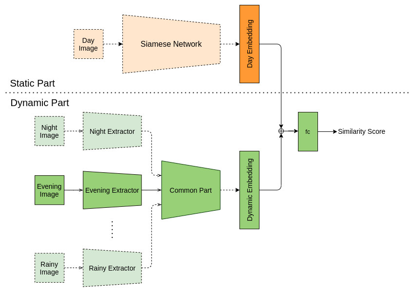

# cross-domain-localization
Aim is to use Cross-Domain images and compare them against a static map to localize an autonomous car or robot.

We use a cross-domain model for getting similarity score of the dynamic image with the static image present in the static map.
The model is able to handle multiple dynamic domains such as night, evening, rainy, etc.

Current inference method is via binning, sequences, and local localization. Currently, we are incorporating particle filters to replace the coarse binning method.

**My major contribution**: DynamicNet in networks/crossdomain_dynamic.py 
